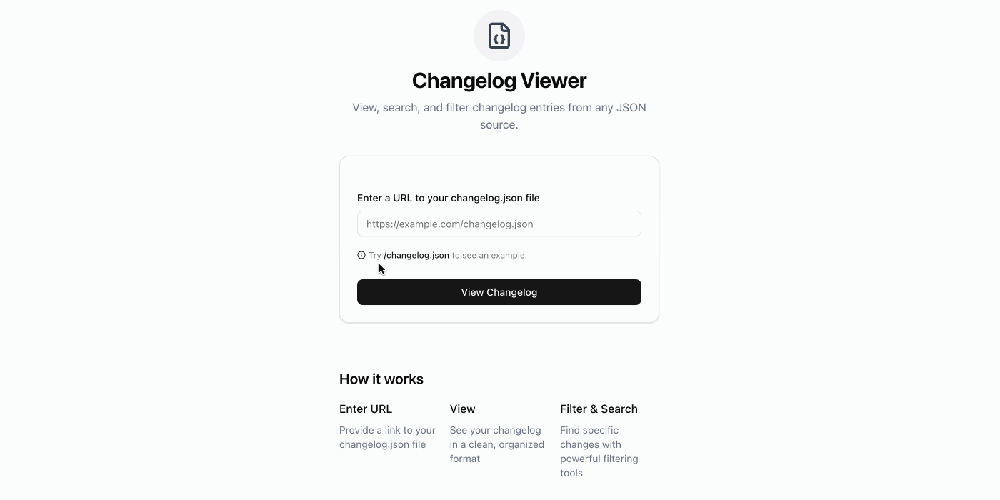

<div align="center">
    <h1>chlog-web</h1>
    <p>View, filter and share your changelog's generated with <a href="https://github.com/ammar-ahmed22/chlog"><code>chlog</code></a></p>
    <p>Try it out at: <a href="https://chlog-web.vercel.app">https://chlog-web.vercel.app</a></p>
</div>
<div align="center">

</div>

## How it works
1. Generate your changelog using [`chlog`](https://github.com/ammar-ahmed22/chlog)
2. Host your changelog JSON file anywhere publicly accessible (e.g. public folder of your website, GitHub repo, API, etc.)
3. Provide the URL to the JSON file on the website
4. View your changelog in a user-friendly format with filtering and custom, shareable URLs

## Running Locally
Clone the repo:
```bash
git clone https://github.com/ammar-ahmed22/chlog-web.git
```
Navigate to the directory:
```bash
cd chlog-web
```
Install dependencies:
```bash
npm install --legacy-peer-deps
```
Start the development server:
```bash
npm run dev
```

### Testing with your own changelog
1. Generate a changelog using [`chlog`](https://github.com/ammar-ahmed22/chlog)
2. Replace the `changelog.json` file in the `public` folder with your own changelog JSON file
3. Start the development server and view your changelog at `http://localhost:3000/?src=%2Fchangelog.json`

## Design Rationale
